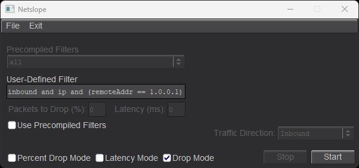
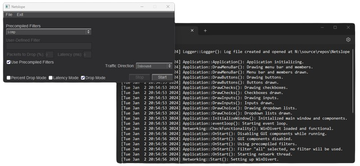

  

<h2>Introduction</h2>

**Netslope** is a simple local machine network manipulation application. It allows users to dynamically drop, drop a percentage of, or add latency to packets matching a user-defined or pre-compiled filter while maintaining the ability to reinject manipulated (non-dropped) packets. 

It allows users to:
- Define a custom filter to match packets to.
- Drop packets that match said filter.
- Add latency to packets that match said filter.
- Drop a percentage of packets that match said filter.

The application features a simple, friendly, dark mode graphical user interface - allowing users to quickly switch between modes (Drop, Percent Drop, and Latency), as well as easily start/stop network operations on the fly. The application also includes extensive logging capabilities to diagnose errors that may occur, as well as provide a detailed call-stack for the operations performed in the application.

<h2>Dependencies</h2>

When building from source, **Netslope** requires three dependencies:
1. **FLTK** (for graphical user interface components).
2. **fmt** (for C-style `printf()` emulation and logging).
3. **WinDivert** (for kernel-level network stack manipulation).

<h2>Netslope Demo</h2>

  

  

  

